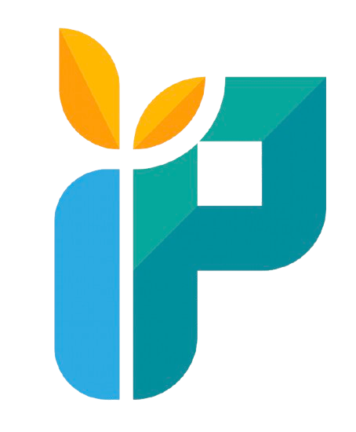

# Yayasan Insan Prihatin

A prestigious Malaysian foundation website built with Next.js, featuring a modern design, CMS capabilities, and SEO optimization.



## Overview

Yayasan Insan Prihatin is a foundation dedicated to community service, focusing on education, healthcare, environment, and community development programs across Malaysia.

## Tech Stack

- **Framework**: Next.js 16 with App Router and Server-Side Rendering
- **Styling**: Tailwind CSS 4
- **Database**: NeonDB (PostgreSQL)
- **ORM**: Drizzle ORM
- **Storage**: Appwrite Bucket
- **Authentication**: Neon Auth
- **Animations**: Framer Motion
- **Language**: TypeScript

## Features

### Public Pages
- **Homepage**: Hero section, about, impact statistics, programs overview, and CTA
- **About**: Organization history, mission/vision, leadership team, and annual reports
- **Projects**: Filterable project listings with categories
- **Blog**: News, stories, events, and announcements
- **Contact**: Contact form, office information, and FAQ
- **Donate**: Donation form with program selection and amount options

### Admin Dashboard
- **Content Management**: Edit hero section, about content, and other site sections
- **Projects Management**: Create, edit, and manage projects
- **Blog Management**: Write and publish blog posts
- **Team Management**: Manage organization chart and team members
- **Donations**: View and track donations
- **Messages**: View contact form submissions
- **Media**: Manage uploaded files and images
- **Settings**: Site-wide settings and configuration

### SEO Features
- Dynamic metadata for all pages
- Open Graph and Twitter Card support
- Schema.org structured data (Organization, Website, Article, FAQ, Breadcrumb, Donation)
- Sitemap and robots.txt support
- Canonical URLs
- Mobile-responsive design

## Getting Started

### Prerequisites

- Node.js 18+
- npm or yarn
- NeonDB account
- Appwrite account

### Installation

1. Clone the repository:
```bash
git clone https://github.com/yourusername/insanprihatin.git
cd insanprihatin
```

2. Install dependencies:
```bash
npm install
```

3. Set up environment variables:
```bash
cp .env.example .env.local
```

Edit `.env.local` with your credentials:
```env
# NeonDB Configuration
DATABASE_URL="postgresql://..."

# Neon Auth Configuration
NEON_AUTH_URL="https://..."
NEON_AUTH_JWKS_URL="https://..."

# Appwrite Configuration
NEXT_PUBLIC_APPWRITE_ENDPOINT="https://..."
NEXT_PUBLIC_APPWRITE_PROJECT_ID="..."
APPWRITE_API_KEY="..."
NEXT_PUBLIC_APPWRITE_BUCKET_ID="..."

# Site Configuration
NEXT_PUBLIC_SITE_URL="https://..."
NEXT_PUBLIC_SITE_NAME="Yayasan Insan Prihatin"
```

4. Push database schema:
```bash
npm run db:push
```

5. Run the development server:
```bash
npm run dev
```

Open [http://localhost:3000](http://localhost:3000) to view the site.

## Project Structure

```
src/
├── app/                    # Next.js App Router pages
│   ├── admin/             # Admin dashboard pages
│   ├── about/             # About page
│   ├── blog/              # Blog pages
│   ├── contact/           # Contact page
│   ├── donate/            # Donation page
│   ├── projects/          # Projects pages
│   └── page.tsx           # Homepage
├── components/
│   ├── layout/            # Header, Footer
│   ├── sections/          # Page sections (Hero, About, etc.)
│   ├── ui/                # UI components
│   ├── admin/             # Admin components
│   └── SEO/               # SEO components
├── db/
│   ├── index.ts           # Database connection
│   └── schema.ts          # Drizzle schema
├── lib/
│   ├── appwrite.ts        # Appwrite client
│   ├── auth.ts            # Authentication utilities
│   ├── seo.ts             # SEO utilities
│   └── utils.ts           # General utilities
└── styles/
    └── globals.css        # Global styles and Tailwind config
```

## Color Palette

Derived from the foundation logo:

- **Amber** (Golden/Hope): `#F5A623` - `#E8942A`
- **Teal** (Trust/Compassion): `#2AADAD` - `#1E9696`
- **Sky Blue** (Stability): `#3BABE8` - `#2D9BD4`
- **Charcoal** (Professional): `#2D3436`
- **Cream/Pearl** (Warmth): `#FDF6E9` - `#F8F9FA`

## Available Scripts

- `npm run dev` - Start development server
- `npm run build` - Build for production
- `npm run start` - Start production server
- `npm run lint` - Run ESLint
- `npm run db:push` - Push database schema
- `npm run db:generate` - Generate migrations
- `npm run db:studio` - Open Drizzle Studio

## Deployment

This project is optimized for deployment on Vercel:

1. Push to GitHub
2. Import project in Vercel
3. Add environment variables
4. Deploy

## License

This project is proprietary to Yayasan Insan Prihatin.

## Contact

For inquiries about this project:
- Email: info@insanprihatin.org
- Website: https://insanprihatin.org
